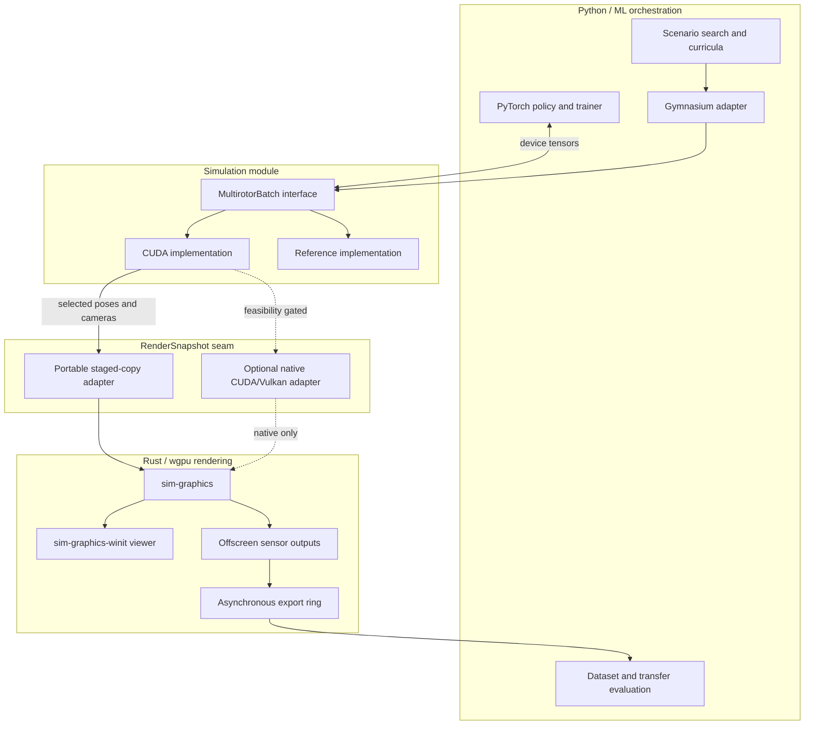
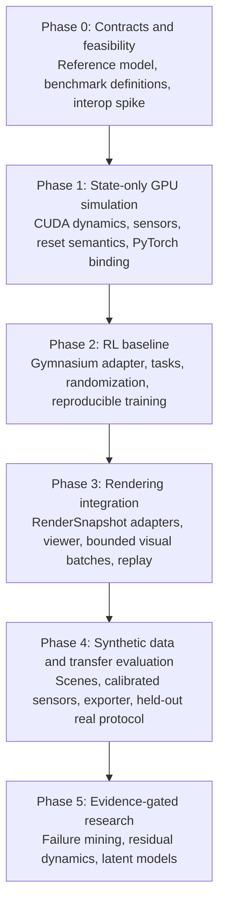

# GPU-Native Multirotor RL Environment and Synthetic Data Simulator

## Architecture, Theoretical Contracts, and Evidence-Gated Roadmap

> **Status:** Living engineering plan. The physical conventions, observable semantics, and measurement definitions below are architectural contracts. Kernel decomposition, storage packing, integrator, ML library, model family, and file formats remain implementation choices until measured.

---

## 1. Mission and Scope

Build a simulation and synthetic-data system for autonomous multirotors that can:

1. **Run state-based RL at high throughput.** Keep simulation state, policy inputs, actions, rewards, and reset work on one GPU during the training critical path.
2. **Render calibrated synthetic sensors.** Produce RGB, metric camera depth, and stable object/instance identifiers through `sim-graphics` for selected environments at an independently configured sensor rate.
3. **Measure sim-to-real transfer.** Compare training and evaluation regimes on labeled, held-out real data. The system can quantify and improve transfer; it cannot guarantee zero-shot transfer.
4. **Generate and search structured scenarios.** Represent scenes and disturbances as validated, replayable data rather than generating raw pixels.
5. **Support learned dynamics only when justified by evidence.** Add bounded force/torque residuals or latent predictive models only if they improve held-out prediction or policy outcomes over analytical baselines.

### Initial product boundary

The first physics implementation is a **single free-flying multirotor rigid body with rotor dynamics and terminal ground contact**. Contact-rich cars, rovers, articulated bodies, wheel/tire models, and general rigid-body contact require different state and solver contracts; they are future vehicle-family adapters, not swappable kernels inside the first multirotor module.

### Explicit non-goals

- Simulating every aerodynamic effect from first principles.
- Rendering a camera for every headless RL environment on every control step.
- Treating synthetic labels as evidence of real-world accuracy.
- Promising portable zero-copy sharing between CUDA and WebGPU resources.
- Committing to RK4, PPO, Dreamer, RSSM, Mamba, ONNX, or a particular dataset container before comparative measurements.
- Making CUDA physics cross-platform. Initial physics acceleration targets NVIDIA GPUs; rendering and recorded replay remain cross-platform goals.

---

## 2. Repository Starting Point

The repository already contains useful rendering infrastructure:

- `sim-graphics`: Rust/`wgpu` renderer with instanced primitives, display views, sensor color, `R32Float` depth, `R32Uint` object IDs, pooled targets, and asynchronous staging-buffer readback.
- `sim-graphics-winit`: native window integration.
- `window-demo` and `render-smoke`: interactive and offscreen examples, including WebAssembly/WebGPU-oriented workspace support.

The current renderer consumes CPU-authored `Frame` vectors and uploads instance data with `wgpu::Queue::write_buffer`. Each sensor view currently owns separate 2D targets. Therefore, GPU-authored transforms, true batched camera rendering, and CUDA/renderer interoperation are roadmap work—not existing capabilities.

---

## 3. Architecture and Seams



### 3.1 Simulation seam

The simulation is a deep module. Callers should need only a validated configuration and a small batched interface:

```text
reset(mask?, seed?) -> ResetResult
step(actions)        -> StepResult
snapshot(selection)  -> RenderSnapshot
```

The interface includes tensor shapes and devices, frame conventions, reset behavior, error modes, determinism guarantees, and stream-ordering requirements. Internal kernel count, memory packing, and fusion are implementation details.

The initial ML adapter is PyTorch-specific. A later JAX or framework-neutral adapter may use DLPack or another FFI mechanism, but it must separately define ownership, lifetime, device, and producer/consumer stream synchronization. A tensor pointer alone is not a complete interoperation contract.

### 3.2 CUDA-to-`wgpu` seam

There are two render adapters behind the same logical `RenderSnapshot` interface:

1. **Portable staged-copy adapter — required.** Gather only selected environments, copy asynchronously through bounded staging memory, tolerate one or more frames of latency, and drop visualization frames rather than stall training.
2. **Native external-memory adapter — optional and feasibility-gated.** On a supported NVIDIA/Vulkan platform, a proof of concept may allocate exportable Vulkan memory, import it into CUDA, verify that CUDA and Vulkan select the same physical device, and synchronize ownership with external semaphores. Integrating such resources through `wgpu` requires unsafe, backend-specific HAL access and is not a portable WebGPU feature.

Failure of the native adapter must not block the simulator, viewer, offline renderer, or web replay. Wasm replay consumes recorded data; it does not share CUDA memory.

### 3.3 Scene seam

A versioned scene description owns geometry references, transforms, semantic identities, lights, weather, and scenario parameters. Physics consumes only collision/query representations it explicitly supports. Rendering consumes visual assets. A mesh present in `wgpu` memory does not automatically exist in a CUDA ray-query structure.

---

## 4. Fixed Physical Conventions

These conventions are fixed across reference physics, CUDA physics, logs, tasks, and exported metadata. Renderer-specific coordinates are converted at the `RenderSnapshot` seam.

### 4.1 Frames, units, and attitude

- All physical quantities use SI units: metres, seconds, kilograms, radians, newtons, and newton-metres.
- World frame $W$: right-handed East-North-Up (ENU), with gravity
  $$
  \mathbf g_W = [0, 0, -g]^T, \qquad g \approx 9.80665\ \mathrm{m/s^2}.
  $$
- Body frame $B$: right-handed Forward-Left-Up (FLU), fixed to the vehicle centre of mass.
- Camera optical frame $C$: right-handed $x$ right, $y$ down, $z$ forward. Every camera has calibrated intrinsics and an explicit rigid transform between $B$ and $C$.
- $\mathbf q_{WB} = [w,x,y,z]$ is a scalar-first Hamilton unit quaternion whose active rotation $R_{WB}$ maps body-frame vectors into the world frame.
- $\mathbf v_W$ is world-frame linear velocity. $\boldsymbol\omega_B$ is body-frame angular velocity.
- Exported timestamps use simulation time. Physics advances on a fixed timestep and control uses an integer number of physics substeps. Other simulated sensors use deterministic, timestamped schedules; display and export consumers may run asynchronously.

The renderer currently uses a right-handed, Y-up graphics convention. The render adapter performs one documented basis change from ENU/FLU into renderer coordinates; physics never adopts graphics coordinates implicitly.

### 4.2 Multirotor equations of motion

For position $\mathbf p_W$, velocity $\mathbf v_W$, body angular velocity $\boldsymbol\omega_B$, body inertia $I_B$, total body force $\mathbf F_B$, world-frame external force $\mathbf F_W^{ext}$, and total body torque $\boldsymbol\tau_B$:

$$
\dot{\mathbf p}_W = \mathbf v_W
$$

$$
m\dot{\mathbf v}_W = m\mathbf g_W + R_{WB}\mathbf F_B + \mathbf F_W^{ext}
$$

$$
I_B\dot{\boldsymbol\omega}_B = \boldsymbol\tau_B - \boldsymbol\omega_B \times (I_B\boldsymbol\omega_B)
$$

$$
\dot{\mathbf q}_{WB} = \frac{1}{2}\mathbf q_{WB}\otimes[0,\boldsymbol\omega_B].
$$

Numerical integration must maintain a normalized attitude representation. Quaternion renormalization, exponential-map updates, and integrator selection are implementation choices subject to convergence and stability tests.

### 4.3 Rotor and actuator model

The initial model has $M=4$ rotors in a validated Quad-X configuration, while the equations remain defined for fixed $M$:

$$
\dot\Omega_i = \frac{\Omega_{i,cmd}-\Omega_i}{\tau_i},
\qquad
\mathbf F_{i,B} = k_{f,i}\Omega_i^2\mathbf d_{i,B},
$$

$$
\boldsymbol\tau_{i,B}
= \mathbf r_{i,B}\times\mathbf F_{i,B}
+ s_i k_{m,i}\Omega_i^2\mathbf d_{i,B},
$$

where $\mathbf r_{i,B}$ is rotor position, $\mathbf d_{i,B}$ is its thrust direction, and $s_i\in\{-1,+1\}$ is the signed reaction-torque direction on the body. Rotor ordering, position, direction, physical spin, derived torque sign, limits, and coefficients are named configuration—not undocumented tensor columns.

A normalized action is converted to commanded rotor speed through a monotonic, configurable actuator map. The first implementation may use an affine map. Saturation is part of the model and occurs before integration.

This is a calibrated quadratic rotor model, not blade-element momentum theory. Higher-order inflow, ground effect, battery sag, downwash, and wake interactions are later analytical or learned corrections.

### 4.4 Aerodynamics and environment

The baseline supports wind-relative empirical drag. With $\mathbf v_{rel,W}=\mathbf v_W-\mathbf v_{wind,W}$, drag is evaluated in a documented frame using validated linear and/or quadratic coefficients. The exact parameterization is replaceable; its units, sign, and frame are not.

Phase 1 ground interaction is a termination condition against an analytic plane or height function. Bounce, friction, resting contact, wheels, and general collision response require a contact solver and are outside the initial module.

### 4.5 Time integration

The physical model is fixed; the integrator is not. Phase 0 compares at least a simple baseline and a higher-order method—for example semi-implicit Euler, midpoint/RK2, and RK4 or a Lie-group attitude update—at equal control quality and stability.

The selected method must:

- use a fixed, explicit physics timestep for reproducibility;
- integrate coupled rotor and rigid-body state consistently;
- support an integer number of physics substeps per control step;
- demonstrate the expected convergence trend on smooth trajectories;
- remain stable over the declared parameter and action envelope; and
- define behavior at discontinuities such as saturation, termination, and reset.

RK4 is therefore a candidate, not an architectural requirement.

#### Current integration selection (2026-09-04)

Production CPU and CUDA stepping use coupled explicit midpoint/RK2, including motor speeds at both stages and normalized stage/output attitude. The discarded semi-implicit implementation and its selection experiment are preserved in JJ revision `vpommxpy` (`319431e2`), not in current source. Each supplied physics timestep must be strictly less than twice **every** rotor time constant; validation rejects the non-decaying motor limit and larger steps without silently subdividing time. This is a motor stability condition, not a general rigid-body stability or accuracy guarantee.

The original selection experiment swept 1–2,048 physics substeps per 10 ms control interval against double-precision RK4 traces. Its measurements below are historical evidence for the selection, not a retained alternative implementation or a baseline directly comparable to the current production-path benchmark.

On the RTX 2070 SUPER, a 10,000-environment **homogeneous replicated** batch over 100 control calls passed all four scenarios—hover, motor command reversals, coupled attitude motion, and unequal-inertia torque-free rotation—with midpoint at **16 substeps (0.625 ms)**. Maximum errors across these traces were approximately 0.107 mm position, 0.192 mm/s velocity, 0.000146 rad/s angular rate, 0.0000116 rad attitude, and 0.0422 rad/s rotor speed. The provisional gates are 1 mm, 1 mm/s, 0.001 rad/s, 0.001 rad, and 0.1 rad/s respectively. No tested baseline substep count passed every gate across all four scenarios; fine-step float32 error is not monotonically decreasing.

That experiment's Release-build median device times for the selected configuration were 3.2–6.9 ms per 100-control-call trajectory, depending on scenario, with uncontrolled clocks/power. These are physics-only measurements, not full-environment or training throughput, and do not establish a matched-accuracy speedup ratio when no baseline configuration passes. The retained scenario/parameter envelope is defined in `cuda/benchmarks/physics_cases.hpp`; 0.625 ms is a measured starting point, not a universal timestep default or proof of the broader flight envelope.

#### Current native physics batch

`cuda/src/physics_batch.hpp` defines `PhysicsBatch`, which owns per-environment float32 physical state and vehicle parameters on a fixed CUDA device. Environment count, physics timestep, and substep count are fixed at construction. Initial state and parameters are explicit device arrays; construction waits for validation and rejects the entire creation if any row is invalid. The old raw-buffer launcher is removed.

- `step` borrows full-batch device actions and advances owned state in place with the selected midpoint method.
- `apply_reset` accepts full-batch device mask/state/parameter arrays and writes per-environment statuses. Each selected pair commits together only if both records validate; invalid and unselected rows retain their previous state and parameters. Invalid state takes precedence over invalid parameters. Actual rotor speeds need not lie within command limits.
- `export_state` copies requested typed fields or full records into caller-owned device arrays. Selection is all environments or an ordered device index array, including duplicates. Indexed exports require statuses; invalid IDs leave data outputs untouched. Even an empty batch reports invalid IDs for a nonempty indexed selection.

One serialized host caller owns each batch's operation sequence. A batch-owned event orders every step, replacement, and export across supplied streams; an export therefore observes its position in that sequence, not later mutations. Callers must make borrowed inputs ready on the supplied stream, preserve their contents until consumed, and keep all borrowed allocations alive until queued use completes. Nonempty spans require storage on the configured CUDA device, not host or managed memory; declared allocation extents remain the caller's responsibility. Export outputs cannot overlap each other or their selector, and reset status cannot overlap reset inputs.

Normal operations allocate no storage and do not synchronize the host. Creation, destruction, and CUDA-error cleanup may wait. This batch does not own curriculum, randomization profiles, reset generation, episode counters, RNG state, observations/rewards, or checkpoint semantics; higher layers supply concrete reset data, including data generated on the GPU. It adds no new physics or numerical-failure policy for stepping.

Implementation evidence in JJ change `mkuzstvn`: CUDA-build and CPU-only correctness suites passed, as did two complete production benchmark runs and both motor-refinement levels. Compute Sanitizer reported zero errors for the batch tests and the benchmark at base count 257 (larger case 2,570). A throwaway instrumented smoke submitted 30 step/reset/export operations while a stream was deliberately blocked, checked resulting physical snapshots, and counted zero C++ allocations, CUDA allocation/free calls, and explicit host waits/synchronous copies during those operations. This checks the exercised steady-state path, not opaque driver-internal memory management.

#### Production regression benchmark

`sim_cuda_physics_benchmark` calls the public `PhysicsBatch::step` interface; it has no private stepping kernel or competing integrator. The default workload set times the four scenarios at 10,000 environments plus coupled attitude at 100,000 environments, all at 16 substeps per 10 ms control call. `--environments N` changes the base count; the larger case remains `10*N`. The double-precision RK4 oracle is checked by refinement, and accuracy uses indexed public exports of the first/middle/last environment after each control call, checking every export status. Additional motor-transient refinement at 32 and 64 substeps uses separate fixed-timing batches and is accuracy-only, with float32 error floors.

```sh
nu cuda/build.nu --release
cuda/build/sim_cuda_physics_benchmark --label REVISION --output cuda/build/physics-baseline.tsv
# After rebuilding the revision being compared, on the same machine:
cuda/build/sim_cuda_physics_benchmark --label NEW_REVISION --baseline cuda/build/physics-baseline.tsv --output cuda/build/physics-current.tsv
```

Use actual revision identifiers for the labels. Saved reports include hardware/compiler/configuration metadata and fingerprints of the scenario parameters, initial states, and action schedules. Comparison requires matching metadata and complete workload/count/substep sets; incompatible, malformed, or incomplete reports are rejected. A workload that fails accuracy in either run is ineligible for a timing percentage. Correctness failures return nonzero, but timing changes are informational: report event/wall median deltas and min/max spread, then repeat suspicious measurements rather than applying an arbitrary CI slowdown threshold. Sample ranges are not confidence intervals, and clocks/system load remain uncontrolled.

Both timers cover the public step sequence, including host span checks, stream-ordering events, and launch overhead; wall time additionally includes waiting for completion. Creation, checked masked state/parameter reset, allocation, preuploaded action schedules, exports/readback, and logging are outside the timed interval. The batch is reused across scenarios and reset before each timed trial. Its owned in-place state and full per-environment parameters/actions make old raw-launcher and selection-experiment timings incompatible baselines; reports identify the suite as `production-physics-batch-v2`. Memory reporting gives a workspace device-payload lower bound including owned state/parameters, separately reports host payload and process RSS, and excludes CUDA resources rather than claiming whole-GPU peak memory.

---

## 5. Logical State and Tensor Contracts

The following is the logical schema. The backend may use structure-of-arrays, array-of-structures, fused workspaces, or opaque packed tensors internally. Public fields must not depend on magic column offsets.

| Logical value | Shape | Type | Meaning |
| :--- | :--- | :--- | :--- |
| `position_w` | `[N, 3]` | `float32` | $\mathbf p_W$ in metres |
| `attitude_wb` | `[N, 4]` | `float32` | Unit $\mathbf q_{WB}=[w,x,y,z]$ |
| `linear_velocity_w` | `[N, 3]` | `float32` | $\mathbf v_W$ in m/s |
| `angular_velocity_b` | `[N, 3]` | `float32` | $\boldsymbol\omega_B$ in rad/s |
| `rotor_speed` | `[N, M]` | `float32` | Actual $\Omega_i$ in rad/s |
| `actions` | `[N, M]` | `float32` | Normalized actuator commands in `[0,1]` |
| `wind_velocity_w` | `[N, 3]` | `float32` | Local ambient wind in m/s |
| `sensor_bias` | task-defined | `float32` | Persistent accelerometer/gyro bias state |
| `rng_counter` | implementation-defined | integer | Counter-based stochastic state |
| `elapsed_steps` | `[N]` | integer | Control steps in the current episode |
| `episode_id` | `[N]` | integer | Monotonic episode identity per environment |
| `observations` | `[N, ObsDim]` or dict | `float32` | Task-defined policy observation |
| `rewards` | `[N]` | `float32` | Task reward for the transition |
| `terminated` | `[N]` | `bool` | MDP terminal state, such as crash or task success |
| `truncated` | `[N]` | `bool` | External cutoff, such as a time limit |
| `termination_code` | `[N]` | integer enum | Stable cause for diagnostics |

Vehicle parameters are a validated named bundle: mass, a positive-definite inertia tensor, rotor geometry, physical spin and reaction-torque signs, thrust/torque coefficients, actuator limits and time constants, and aerodynamic coefficients. Per-environment packing is private to the backend so the parameter set can evolve without changing every caller.

### 5.1 Ownership and execution

- State is owned by the simulation module; callers receive documented tensor views or results, not unrestricted mutable aliases.
- Actions must be on the configured device with the declared shape and dtype. Invalid inputs fail before launching work where practical.
- The PyTorch adapter must respect the current CUDA stream or establish explicit producer/consumer events. It must not rely accidentally on the legacy default stream.
- Host synchronization is absent from the headless `step` critical path. Logging that requires scalar host values is rate-limited and explicit.
- Temporary storage is allocated during creation or capacity growth, not during each steady-state step.

### 5.2 Reset and episode semantics

The engine distinguishes `terminated` from `truncated`; there is no ambiguous `done` tensor in the core interface.

Autoreset is a configured semantic mode compatible with the Python adapter:

- **Disabled:** terminal observation is returned and the environment remains ended until reset.
- **Next-step:** terminal observation is returned; reset occurs before consuming that environment's next action.
- **Same-step:** returned observation is the reset observation, while `final_observation`, final episode statistics, and masks preserve the transition that ended.

A fused reward/termination/reset kernel is allowed only if it preserves those observable semantics. Timeout is truncation by default. A crash or arena failure is termination unless a task specification says otherwise.

### 5.3 Reproducibility

Randomization and sensor noise use a counter-based scheme derived from stable identities such as `(base_seed, environment_id, episode_id, stream_id, sample_index)`. Reset ordering or unrelated environments must not silently perturb another environment's random stream.

Exact bitwise equality is required only on the same supported software/hardware path when declared by that backend. Cross-backend verification uses numerical tolerances and distributional tests because floating-point reduction and transcendental implementations may differ.

---

## 6. Sensor Contracts

### 6.1 IMU

At a sensor located at the centre of mass, ideal gyroscope and accelerometer outputs are:

$$
\tilde{\boldsymbol\omega}_B
= \boldsymbol\omega_B + \mathbf b_g + \mathbf n_g,
$$

$$
\tilde{\mathbf f}_B
= R_{BW}(\mathbf a_W-\mathbf g_W) + \mathbf b_a + \mathbf n_a.
$$

The accelerometer measures **specific force**, not world acceleration with gravity added. Sensor-axis misalignment, scale error, saturation, quantization, latency, and an offset lever arm may be introduced later as explicit model terms.

Bias follows a documented stochastic process, such as a discrete random walk:

$$
\mathbf b_{k+1}=\mathbf b_k+\sigma_b\sqrt{\Delta t}\,\boldsymbol\xi_k.
$$

Noise parameters must state whether they are continuous-time densities or per-sample standard deviations so changing the sensor rate does not silently change the physical model.

### 6.2 Range sensing

The first range sensor intersects a configured ray with an analytic ground plane or height field and reports range along the ray. General mesh raycasting is a future geometry-query adapter with its own acceleration structure; it is not delegated implicitly to render meshes.

### 6.3 Visual sensors

Each visual sample records:

- simulation timestamp and camera exposure interval;
- image dimensions;
- camera intrinsics and distortion model;
- camera extrinsics;
- near/far planes and depth convention;
- scene, environment, episode, frame, and randomization identifiers; and
- renderer and asset version metadata.

Canonical outputs:

| Output | Contract |
| :--- | :--- |
| Color | Exported RGB is explicitly tagged with its transfer function; default dataset output is sRGB RGB8, with optional linear/HDR output for sensor modeling. |
| Depth | `float32` metres along optical $+z_C$ (camera z-depth, not Euclidean range). Background is represented by the far value and object ID `0`. |
| Object ID | `uint32`; `0` is background and every nonzero ID maps through per-frame metadata to a stable instance and semantic class. |

“Pixel-perfect” means aligned with the simulator's rendered visibility and label ontology. It does not imply perfect real-world labels. RGB realism additionally depends on assets, materials, lighting, camera response, exposure, motion blur, rolling shutter, distortion, noise, and compression.

### 6.4 Visual scaling rule

Physics count and visual-sensor count are independent:

- $N_{physics}$ may be $10{,}000+$.
- $N_{visual}\ll N_{physics}$ is selected explicitly.
- Visual sensors run at their own rate and may use stale-but-timestamped snapshots.
- Viewer and exporter backpressure drops or delays render work; it never blocks headless training by default.

Raw output bandwidth is unavoidable. At $256\times256$, a four-byte color attachment, `float32` depth, and `uint32` IDs require 12 bytes/pixel. Rendering all three for 10,000 cameras would produce roughly 7.3 GiB per sensor tick before internal attachments or encoding, so “render every environment simultaneously” is not a design target.

---

## 7. Scenario Generation and Sim-to-Real Evaluation

### 7.1 Structured scenarios

Scenarios are versioned, schema-validated data containing asset references, poses, trajectories, weather, lighting, sensor configuration, and randomization distributions. Every realized scenario has a seed and can be replayed without the generator.

Generation proceeds in increasing complexity:

1. deterministic fixtures;
2. parameterized procedural generation;
3. distribution sampling and mutation;
4. optimization or adversarial search over valid parameters; and
5. optional model- or prompt-assisted proposals that still pass schema and feasibility validation.

An LLM is therefore a possible proposal mechanism, not the world model or source of truth.

### 7.2 Dataset protocol

- Define a versioned label ontology before export.
- Split real data by flight, site, and collection session to prevent adjacent-frame leakage.
- Keep a final real test split untouched by scene tuning, model selection, and threshold selection.
- Record provenance and randomization parameters for every synthetic frame.
- Store images/masks in suitable media files or shards and metadata in a versioned manifest. COCO, YOLO, Parquet, or another container may be provided by adapters; no single format must carry every payload.
- Validate exported geometry with simple scenes whose projected boxes, depth, occlusion, and IDs are analytically known.

### 7.3 Transfer evaluation

The evaluation harness measures downstream performance under explicit regimes:

- pretrained model without simulator-specific training;
- synthetic-only training;
- real-only training with a declared label budget;
- synthetic pretraining followed by real fine-tuning; and
- mixed real/synthetic training.

Primary evidence is performance on the untouched real test set using task-appropriate metrics such as class-wise mIoU, boundary F1, mask AP, calibration, and failure slices. A “sim-to-real gap” always names the two regimes and datasets being subtracted; it is not computed by comparing unpaired pixels.

SAM, YOLO segmentation models, DINO-family encoders, or later models are versioned evaluation adapters, not architectural dependencies. Prompting and class mapping are part of each adapter's protocol. Representation distance may diagnose domain shift but is not a substitute for downstream real-data performance.

Scene parameters may be tuned on training/tuning splits. The final test split is evaluated only at release gates. The project claims measured transfer and confidence intervals—not parity or guaranteed zero-shot behavior.

---

## 8. Optional Learned Models

### 8.1 Aerodynamic residual

A learned residual may predict bounded body-frame force and torque corrections:

$$
(\Delta\mathbf F_B,\Delta\boldsymbol\tau_B)
= f_\theta(\text{state},\text{action},\text{context}).
$$

It is admitted only after:

- synchronized real or higher-fidelity force/trajectory data exists;
- train/tuning/test trajectories are separated by flight regime;
- it improves held-out one-step and closed-loop rollout error over the analytical model;
- outputs are bounded or gated outside supported data; and
- batch latency and launch overhead are measured inside the actual simulation loop.

The inference implementation—generated CUDA, a fused framework operation, TorchScript, ONNX, or another path—is selected from measurements. A nominal sub-millisecond claim without batch size and synchronization scope is not an acceptance criterion.

### 8.2 Latent predictive model

A latent dynamics model is a separate research module, not the scenario generator. It is justified only if it improves sample efficiency, planning performance, or total training cost after accounting for model training and exploitation of model error. RSSM, transformer, state-space, or other architectures compete under the same held-out rollout and policy-evaluation protocol.

Latent “steps/sec” must be reported together with batch size, horizon, model size, device, precision, and whether decoding or policy inference is included.

### 8.3 Failure mining

Failure mining searches a bounded, valid scenario parameter space against a frozen policy checkpoint and explicit failure objectives. Results retain seeds and full scenario records. Mined examples enter a curriculum only after deduplication and evaluation on a separate scenario set, preventing the curriculum from degenerating into memorized adversarial cases.

---

## 9. Performance and Measurement Contract

“Steps/sec” is not used without qualification. For $K$ batched control calls, $N$ environments, and elapsed wall time $T$ after warm-up:

$$
\text{vector steps/s}=\frac{K}{T},
\qquad
\text{environment transitions/s}=\frac{KN}{T}.
$$

With $S$ physics substeps per control step:

$$
\text{physics state updates/s}=S\frac{KN}{T}.
$$

At control frequency $f_c$, aggregate real-time factor is:

$$
\mathrm{RTF}=\frac{KN/T}{Nf_c}=\frac{K/T}{f_c}.
$$

Every benchmark records:

- GPU, driver, power/clock policy, CPU, OS, and build profile;
- environment count, timestep, substeps, observation/action dimensions, and enabled model terms;
- precision and deterministic settings;
- warm-up and sample duration;
- CUDA-event device time and end-to-end wall time;
- whether policy inference, reward, reset, randomization, sensors, rendering, readback, and logging are included; and
- peak device and host memory.

Required benchmark tiers:

| Tier | Included |
| :--- | :--- |
| Physics microbenchmark | Dynamics and integration only |
| Full environment | Physics, kinematic sensors, observations, rewards, termination, and configured reset semantics |
| Training loop | Full environment plus policy forward/backward and optimizer |
| Visual pipeline | Selected snapshots, rendering, requested outputs, and separately measured readback/export |

Initial capacity floor: **10,000 state-only environments at a 100 Hz control rate in real time or faster on the RTX 2070 SUPER target**, equivalent to at least 1,000,000 environment transitions/s for the full-environment tier. This is a useful minimum, not a claimed maximum. Maximum throughput is established by Phase 1 measurements.

Rendering throughput is reported in sensor megapixels/s by output set and resolution, not only cameras/s. Viewer cost is reported as frame-time percentiles and measured training-throughput change under a fixed workload. The viewer must not introduce a synchronous dependency into `step`; a universal `<0.5%` same-GPU overhead promise is not credible.

---

## 10. Implementation Roadmap



### Phase 0: Contracts and feasibility

**Goal:** Retire theoretical ambiguity and the highest-risk platform assumption before optimizing.

- [ ] **Freeze the v1 physical contract**
  - Encode frame, quaternion, unit, actuator, timing, and termination conventions in types/configuration.
  - Define the valid parameter and action envelope.
- [ ] **Build a reference multirotor model**
  - Favor clarity and `float64` verification over throughput.
  - Cover force/torque allocation, motor lag, rigid-body derivatives, and sensor truth.
- [ ] **Create analytic and convergence fixtures**
  - Free fall, stationary supported IMU, constant rotation, symmetric hover, zero-force drift, and drag decay.
  - Compare integrators by error, stability, and cost before selecting one.
- [ ] **Specify benchmark tooling**
  - Emit the metadata and qualified rates from Section 9.
  - Prevent accidental host synchronization from being hidden outside the measured interval.
- [ ] **Prototype the render transfer seam**
  - Implement or measure a minimal staged path against the current CPU-authored `Frame` interface.
  - Test whether `wgpu` 30's unsafe Vulkan HAL route can safely wrap exportable memory and synchronize with CUDA on the target machine.
  - Record a go/no-go decision for native interop; retain staging as the supported fallback.

**Exit gate:** Reference trajectories and conventions are executable; benchmark terms are unambiguous; rendering has a proven fallback; native interop is classified as supported, experimental, or rejected.

### Phase 1: State-only GPU simulation

**Goal:** Implement the full environment tier without rendering or policy inference.

- [ ] **Implement batched dynamics and selected integration**
  - Couple actuator and rigid-body state correctly.
  - Normalize attitude and detect non-finite or out-of-envelope state.
- [ ] **Implement deterministic reset and randomization**
  - Support masked reset, stable episode IDs, and counter-based random streams.
  - Randomize only named, physically valid parameters.
- [ ] **Implement kinematic sensor state**
  - IMU truth, discrete noise/bias processes, and analytic ground range.
- [ ] **Implement task transition kernels**
  - Observations, rewards, `terminated`, `truncated`, termination codes, and final episode data.
  - Fuse kernels only when profiling shows a benefit and semantics remain unchanged.
- [ ] **Implement the PyTorch adapter**
  - Validate device/dtype/shape, respect CUDA stream ordering, and avoid steady-state allocation and host synchronization.
- [ ] **Verify CPU/GPU equivalence and measure throughput**
  - Compare derivatives and finite trajectories over the declared envelope.
  - Demonstrate the initial 10,000-environment capacity floor or document the measured bottleneck before changing scope.

**Exit gate:** Correctness fixtures pass on reference and CUDA implementations; reset semantics are observable and reproducible; full-environment throughput is reported under the fixed protocol.

### Phase 2: Vectorized RL baseline

**Goal:** Demonstrate that the simulator trains and evaluates a policy correctly.

- [ ] **Implement `DroneVectorEnv`**
  - Expose Gymnasium-compatible `reset()` and five-value `step()` results: observations, rewards, terminations, truncations, and infos.
  - Declare autoreset mode and preserve final observations and episode statistics.
  - Keep a typed tensor-native interface beneath the Python compatibility adapter.
- [ ] **Implement state-based tasks**
  - Begin with hover and target tracking.
  - Add waypoint and state-based gate navigation only after simpler tasks establish correctness.
- [ ] **Implement domain randomization**
  - Sample validated distributions for mass/inertia, rotor coefficients, actuator response, wind, initial state, and sensor characteristics.
  - Version every distribution used in an experiment.
- [ ] **Train a reproducible baseline**
  - Start with a small on-policy baseline; select the library from integration simplicity and profiler evidence.
  - Report success, sample count, wall time, and distribution across multiple seeds.

Initial hover acceptance profile, to be versioned with the task: at least 90% of randomized evaluation episodes remain within the declared position/attitude envelope for a 20-second episode. “Converges in under two minutes” is a stretch measurement on named hardware, not a correctness gate.

**Exit gate:** A saved policy reproducibly meets the versioned hover criterion on held-out randomized seeds, and the end-to-end training profile identifies simulation versus learner cost.

### Phase 3: Rendering integration and replay

**Goal:** Add visualization and bounded visual sensing without coupling renderer cadence to training cadence.

- [ ] **Define and implement `RenderSnapshot`**
  - Select environment IDs and include timestamped poses, object identities, cameras, and scene version.
  - Apply the documented ENU/FLU-to-renderer transform once.
- [ ] **Ship the staged-copy adapter first**
  - Use bounded double/triple buffering and explicit backpressure.
  - Measure gather, transfer, `queue.write_buffer`, and render costs separately.
- [ ] **Resolve the native interop experiment**
  - If Phase 0 proves safety and value, isolate unsafe Vulkan/CUDA ownership and semaphore logic behind a native-only adapter.
  - Otherwise close the path without burdening the portable renderer.
- [ ] **Extend `sim-graphics` for calibrated sensor batches**
  - Budget camera count, resolution, and output set explicitly.
  - Verify color transfer, optical z-depth, object-ID stability, occlusion, and background semantics.
- [ ] **Build the decoupled viewer**
  - Free/orbit and vehicle-mounted views at a display-rate target such as 60 FPS.
  - Drop stale snapshots rather than delaying simulation.
- [ ] **Add versioned trajectory recording and replay**
  - Record conventions, schema version, timestamps, scenario identity, and enough state for reproducible, timestamp-aligned visual replay; bit-exact pixels are required only where a renderer/backend explicitly guarantees them.
  - Support native and web replay through the same logical recording schema.

**Exit gate:** A trained trajectory can be viewed live and replayed; the headless step path remains render-independent; visual correctness fixtures pass; throughput impact is measured rather than assumed.

### Phase 4: Synthetic data and transfer evaluation

**Goal:** Produce auditable datasets and answer whether they improve performance on held-out real data.

- [ ] **Implement the versioned scene schema and procedural generator**
  - Start with gates, towers, terrain/ground, clutter, obstacles, lights, materials, and weather parameters.
  - Preserve generator version, seed, and realized parameters.
- [ ] **Implement camera and image-domain variation**
  - Intrinsics/extrinsics, exposure, transfer function, distortion, noise, blur, rolling shutter, and compression as explicit, independently testable stages.
- [ ] **Implement the asynchronous exporter**
  - Export color, depth, instance IDs, categories, camera calibration, and optional 2D/3D boxes.
  - Provide format adapters based on downstream consumers and validate round trips.
- [ ] **Establish the real-data protocol**
  - Label ontology, privacy/provenance rules, leakage-resistant splits, baselines, model versions, and confidence intervals.
- [ ] **Implement evaluation adapters and reports**
  - Downstream segmentation/detection metrics are primary.
  - Representation metrics and synthetic-vs-real distribution diagnostics are secondary.
- [ ] **Tune without test leakage**
  - Tune generator distributions only on allowed splits; run the held-out real test at declared release gates.

**Exit gate:** Dataset samples are traceable and geometrically validated; at least one complete training/evaluation matrix is reported on an untouched real test split. No fixed mIoU target is set before the dataset, ontology, and baseline exist.

### Phase 5: Evidence-gated research

**Goal:** Add complexity only where a measured baseline exposes a valuable gap.

- [ ] **Adversarial scenario and failure search**
  - Search valid structured parameters, preserve exact replays, and verify curriculum generalization.
- [ ] **Learned force/torque residual**
  - Proceed only with suitable data and improvement on held-out open- and closed-loop metrics.
- [ ] **Latent predictive model**
  - Proceed only with a defined planning or sample-efficiency use case and a non-learned baseline.
- [ ] **Future vehicle-family assessment**
  - Specify a separate state/contact interface and choose an established contact engine or solver strategy before adding ground vehicles.

**Exit gate:** Each research module independently demonstrates net value under a predeclared evaluation and can be disabled without changing core simulator semantics.

---

## 11. Verification Matrix

| Area | Required evidence |
| :--- | :--- |
| Frame and quaternion conventions | Round-trip basis tests; known 90° rotations; body/world force direction fixtures |
| Rigid-body dynamics | Analytic special cases, convergence trend, invariant checks, and comparison to a high-accuracy reference |
| Rotor allocation | Per-rotor force/torque fixtures and symmetric hover equilibrium |
| IMU | Stationary, free-fall, constant-rate rotation, bias, and sample-rate scaling fixtures |
| Randomness | Same-seed repeatability; independence from reset order and unrelated environments; distribution checks |
| Episode semantics | Separate termination/truncation cases; all autoreset modes; preserved final observations and statistics |
| CUDA adapter | Shape/device failures, non-default stream ordering, absence of steady-state allocation, CPU/GPU numerical comparison |
| Performance | All four benchmark tiers with full metadata and qualified rate units |
| Render bridge | Backpressure behavior, dropped-frame accounting, timestamp freshness, staged-path fallback |
| Visual outputs | Known color, z-depth, ID, occlusion, camera projection, and background fixtures |
| Recorder | Schema-version rejection/migration behavior and native/web replay consistency |
| Dataset export | Provenance completeness, format round trip, mask/category integrity, calibration consistency |
| Sim-to-real claims | Leakage-resistant split, named regimes, per-class metrics, uncertainty, and untouched real test results |
| Learned modules | Held-out improvement, closed-loop effect, bounded failure behavior, and total compute cost |

Numerical tolerances belong to each versioned fixture and are derived from precision, timestep, horizon, and task sensitivity. A single global trajectory-error threshold is not meaningful.

---

## 12. Risks and Decision Gates

| Risk | Why it matters | Gate or fallback |
| :--- | :--- | :--- |
| CUDA/`wgpu` external-memory integration is unavailable or fragile | It is backend-specific and unsafe; WebGPU does not expose raw CUDA pointers | Stage selected snapshots through bounded buffers; keep native interop optional |
| Rendering saturates memory bandwidth or VRAM | Pixel cost scales with resolution, outputs, and visual cameras—not physics count | Cap `N_visual`, decimate sensor rate, measure megapixels/s, and separate export workloads |
| Simulator exploits unrealistic dynamics | High RL throughput can optimize model error faster | Validate regimes, randomize justified uncertainty, compare real logs, and retain safety margins |
| Real-data leakage inflates transfer results | Adjacent video frames and repeated locations are strongly correlated | Split by flight/site/session and hold back a final test set |
| Kernel fusion obscures correctness | Fused reset/reward/state code can erase terminal data or complicate tests | Preserve the typed `StepResult`; fuse only behind equivalence fixtures |
| Nondeterminism breaks reproduction | Parallel execution and reset ordering can alter random streams | Counter-based RNG and explicit backend determinism guarantees |
| Learned residual destabilizes control | Extrapolated force/torque can inject energy | Bound/gate outputs and test closed-loop behavior outside training regimes |
| Scope expands into a general robotics engine | Contact-rich vehicles require fundamentally different solvers and state | Finish multirotor gates first; design a new adapter only when a second family is funded |

### Decisions intentionally left open

These are engineering decisions, not missing theory:

- exact integrator and physics timestep;
- kernel fusion and launch strategy;
- internal tensor packing;
- PyTorch extension mechanism and build system;
- RL implementation/library;
- staged-buffer sizing and render batch strategy;
- whether native CUDA/Vulkan interop is worth maintaining;
- recording and dataset container formats;
- scene-search algorithm; and
- learned model architecture and inference runtime.

Changing a fixed physical or observable contract requires a versioned migration. Changing an open engineering choice requires benchmark evidence and must not leak new complexity through the module interface.

---

## 13. Design References

- [ROS REP 103: coordinate conventions and SI units](https://www.ros.org/reps/rep-0103.html)
- [Gymnasium vector environment interface and autoreset semantics](https://gymnasium.farama.org/api/vector/)
- [DLPack specification](https://dmlc.github.io/dlpack/latest/)
- [NVIDIA CUDA Programming Guide](https://docs.nvidia.com/cuda/cuda-programming-guide/)
- [`wgpu` 30 `Device` native HAL escape hatches](https://docs.rs/wgpu/30.0.1/wgpu/struct.Device.html#method.as_hal)
