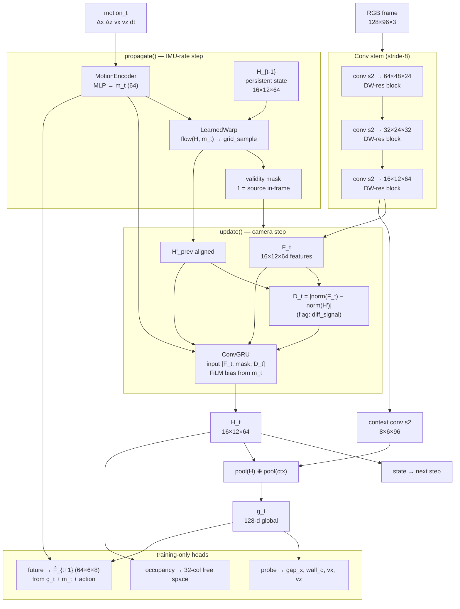

# Visual-inertial encoder (E002)

A small, fast, temporally persistent visual encoder for the E001 corridor task,
following the DeepSeek-V4.1-Flash-inspired design discussed for Jetson Orin
Nano–class deployment: compress the input early, keep all temporal compute on a
small spatial latent, and train a richer graph than is deployed.

Scope: encoder + training/evaluation only. No policy changes, no planner.

## Design decisions (from review)

- **Spatial latent at 16×12, not 10×6.** Small obstacles (wall edges, gap
  boundaries) are what kill the drone; one latent cell covers 8×8 input px at
  128×96 input. Probes decode at higher effective resolution than the grid.
- **Learned ego-motion warp, conditioned on Δpose.** The E001 camera translates
  with the drone (no rotation), so translational parallax is the dominant
  apparent motion. A learned flow field conditioned on the motion embedding
  handles translation without needing depth; an analytic SE(3) warp is a later
  option if depth readback lands.
- **Validity mask channel.** Warped state concatenates a mask (1 = source
  in-frame) so the GRU can distinguish "no information" from "empty space".
- **Δpose always conditions fusion** (FiLM-style bias), even when warping is
  disabled — the ablation isolates the warp itself.
- **`dt` is part of the motion input** so the recurrence is not calibrated to a
  fixed frame interval.
- **Probe-based future prediction, not raw-latent collapse risk.** The dynamics
  head predicts the *next frame's encoded features* `F_{t+1}` (stop-grad target)
  plus privileged probes; it never predicts `H_{t+1}` directly.
- **No global temporal transformer in the base model.** Variant H adds a tiny
  causal transformer over pooled `g_t` history; expected to lose the ablation.
- **No RoPE.** Learned 2D positional embeddings; at ≤192 tokens RoPE is a
  rounding error and learned embeds are more TensorRT-friendly.

## Architecture

Input: single RGB frame, 128×96 (env renders at configurable resolution).

```text
128×96×3
  ↓ conv3×3 s2 → 64×48×24, DW-separable residual
  ↓ conv3×3 s2 → 32×24×32, DW-separable residual
  ↓ conv3×3 s2 → 16×12×64, DW-separable residual   → F_t  (spatial features)
  ↓ conv3×3 s2 → 8×6×96                            → context for g_t
```

Persistent state: `H_t ∈ R^{16×12×64}` (ConvGRU hidden state).

```text
motion_t = [Δx, Δz, vx, vz, dt]  →  MLP(→64)  →  m_t

propagate:  H' = grid_sample(H_{t-1}, flow(H_{t-1}, m_t));  mask from grid bounds
update:     D_t = |norm(F_t) − norm(H')|        (optional, flag)
            H_t = ConvGRU([F_t, H', mask, D_t?], H')   conditioned on m_t
            g_t = MLP(pool(H_t) ⊕ pool(ctx_t))  → 128-d
```



API (first-class state, no hidden globals):

```python
state = enc.initial_state(batch)          # H_0 = 0
state = enc.propagate(state, motion)      # warp only — the "IMU-rate" step
out   = enc.update(frame, state, motion)  # encode + warp + fuse — camera step
# out: {H, g, F, probes...}
```

Aux heads (training only, discarded at deployment):

- `gap_x` regression (where is the gap)
- `wall_dist` regression (how far to the wall)
- `vx, vz` regression (ego-motion)
- `occupancy`: 32-column free-space profile (analytic ray-cast against wall
  geometry, no renderer changes)
- `future`: predict `F_{t+1}` (stop-grad) from `(H_t, m_t, action_t)`

## Ablations

| Variant | Change |
|---|---|
| A | frame-independent CNN → probes only (no recurrence) |
| B | A + spatial latent map (probe decodes from F_t map, not pooled vector) |
| C | B + ConvGRU temporal fusion |
| D | C + motion conditioning (m_t into fusion) |
| E | D + ego-motion warp in propagate |
| F | E + explicit D_t difference channel |
| G | F + future-latent prediction loss |
| H | G + tiny causal transformer over g_t history |

## Metrics

- params, MACs (manual counter), peak memory, batch-1 latency (CUDA events), FPS
- probe MAE: gap_x, wall_dist, velocity (held-out episodes)
- occupancy IoU
- future-feature MSE
- occlusion retention: blank N frames mid-sequence, measure probe recovery

## Data

Rollouts collected from `RGBEnv` at 128×96 with a scripted policy (reference
controller + noise + occasional idle/backup for off-distribution coverage).
Stored: per-step RGB frame, vehicle pose (x, z, vx, vz), action, gap_center,
episode id. `vehicle_pose` buffer added to `librgb_env.so` (fields 14+).

## jj / PR plan

Bookmarks at PR-able states:

1. `venc-pose` — pose plumbing (Rust buffer + Python)
2. `venc-core` — encoder module + tests
3. `venc-data` — collection script + dataset
4. `venc-train` — training + eval + bench harness
5. `venc-results` — ablation results + summary
